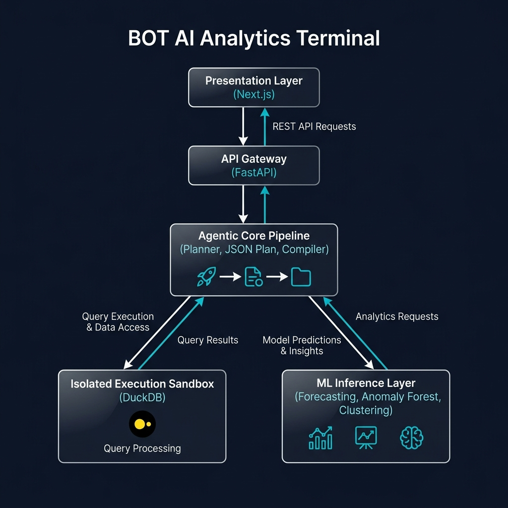
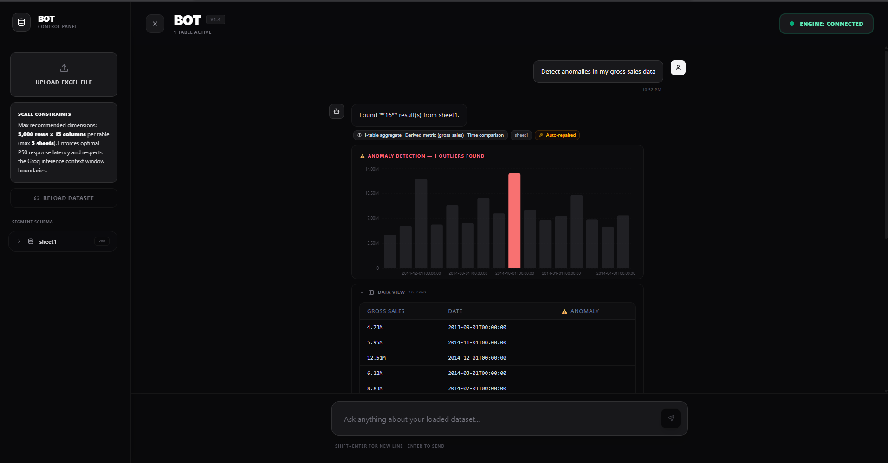
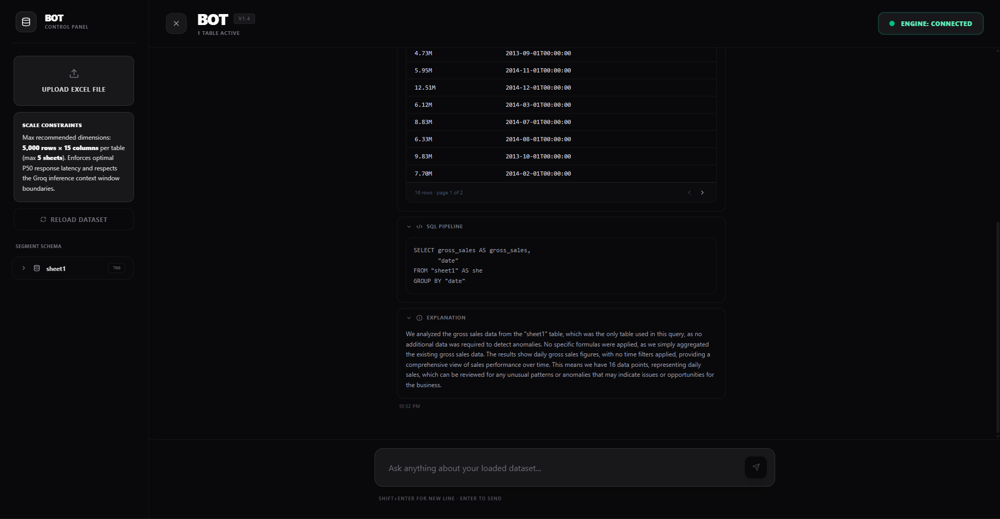
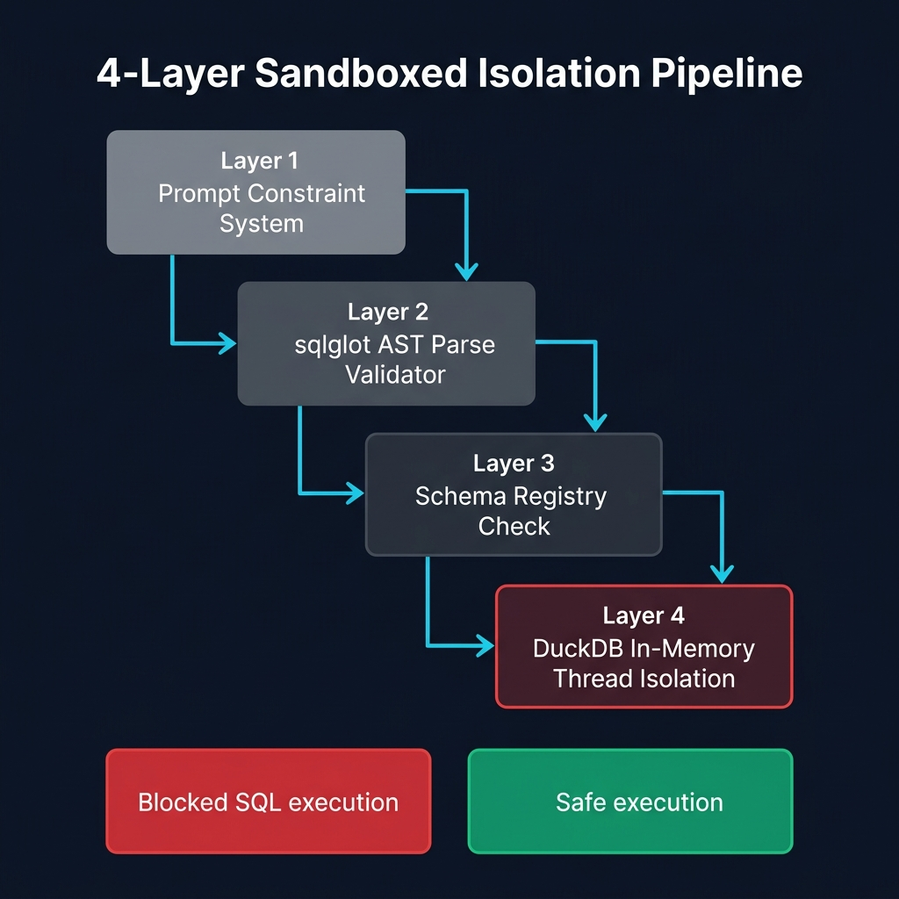

<div align="center">

# 🤖 BOT — Beyond Ordinary Tables

### *An Agentic Machine Learning Platform for Natural Language Business Intelligence*

[](https://github.com/kunal-gh/bot/actions/workflows/ci.yml)
[](https://bot-web-production-1328.up.railway.app)
[](https://python.org)
[](https://nextjs.org)
[](https://fastapi.tiangolo.com)
[](LICENSE)

**[🚀 Live Demo](https://bot-web-production-1328.up.railway.app) · [📖 API Docs](https://bot-api-production-7ddf.up.railway.app/docs) · [📄 Full Docs](./DOCUMENTATION.md) · [🐛 Issues](https://github.com/kunal-gh/bot/issues)**

---

> **BOT** transforms any Excel workbook into a dynamically queryable, high-performance analytics database.
> Users ask questions in plain English — BOT plans, validates, executes, applies real-time ML (Forecasting, Anomaly Detection, Clustering), and explains everything.
> No SQL knowledge required. No data engineering setup. Just upload and ask.

</div>

---

## 📖 Table of Contents

1. [Problem Statement](#-problem-statement)
2. [Solution Architecture](#-solution-architecture)
3. [Core Agentic Pipeline](#-core-pipeline)
4. [Machine Learning Architecture](#-machine-learning-modules)
5. [Technology Stack](#-technology-stack)
6. [Performance & Benchmarks](#-performance--benchmarks)
7. [Repository Structure](#-project-structure)
8. [Deployment (Railway)](#-deployment-railway)
9. [API Reference](#-api-reference)
10. [ML Feature Guide](#-ml-feature-guide)
11. [Security Architecture & Sandboxing](#-security-architecture)
12. [Testing Framework](#-testing)
13. [Roadmap](#-roadmap)
14. [📄 Full Technical Documentation](./DOCUMENTATION.md)

---

## 🎯 Problem Statement

> *"Business teams spend 60-70% of their analytics time waiting for data engineers to write SQL queries. AI chatbots promise to fix this — but real-world text-to-SQL tools fail silently, hallucinate column names, and cannot reason beyond simple data retrieval."*
>
> — Enterprise Data Analytics Research, 2024

### The Five Failure Modes of Existing AI Analytics Tools

| # | Failure Mode | Industry Impact | BOT's Solution |
|---|---|---|---|
| 1 | **Silent wrong answers** | Flawed business decisions | Deterministic JSON-to-SQL compiler + AST validation |
| 2 | **Schema hallucination** | Query crashes, wrong joins | sqlglot AST enforcement + strict Registry check |
| 3 | **No predictive insight** | Reactive-only analytics | Built-in ML pipeline: Forecast, Anomaly, Cluster |
| 4 | **Security vulnerabilities** | Data exposure, injections | Multi-layered Read-only AST enforcer blocks all writes |
| 5 | **Non-deterministic outputs** | Inconsistent KPIs | Structured JSON plan compiler — same query, same SQL |

---

## 🏗️ Solution Architecture



---

## ⚡ Core Agentic Pipeline

To completely bypass SQL injection and semantic errors, the pipeline is **strictly deterministic** — the LLM never writes raw SQL directly. Instead, it compiles structured query intents which our compiler translates to exact SQL dialect.

```
Natural Language Query
        │
        ▼
┌───────────────┐    Pydantic v2     ┌────────────────────────┐
│  LLM PLANNER  │───────────────────>│    JSON QueryPlan      │
│  (OpenAI/     │   System prompt    │  {intent, tables,      │
│   Groq/Ollama)│   Schema Registry  │   filters, metrics,    │
│               │   Glossary context │   join_paths, ...}     │
└───────────────┘                    └───────────┬────────────┘
                                                 │
                                                 ▼
                                     ┌────────────────────────┐
                                     │    PYTHON COMPILER     │
                                     │  Deterministic SQL     │
                                     │  generation from       │
                                     │  the JSON plan         │
                                     └───────────┬────────────┘
                                                 │
                                                 ▼
                                     ┌────────────────────────┐
                                     │   sqlglot AST CHECK    │ ─── Block INSERT/
                                     │  • Read-only check     │     UPDATE/DROP/
                                     │  • Schema ref check    │     ALTER etc.
                                     └───────────┬────────────┘
                                                 │
                                                 ▼
                                     ┌────────────────────────┐
                                     │    DuckDB EXECUTOR     │
                                     │  threading.Thread      │
                                     │  30s timeout           │
                                     │  500 row cap           │
                                     └───────────┬────────────┘
                                            OK   │   FAIL
                                                 ├───► [LLM REPAIR LOOP]
                                                 │     • Self-heals plan
                                                 │     • Re-executes (x1)
                                                 ▼
                                     ┌────────────────────────┐
                                     │  ML INTELLIGENCE LAYER │
                                     │  • Exp. Smoothing      │
                                     │  • Isolation Forest    │
                                     │  • K-Means Clustering  │
                                     └───────────┬────────────┘
                                                 │
                                                 ▼
                                     ┌────────────────────────┐
                                     │     LLM FORMATTER      │
                                     │  • Natural language    │
                                     │  • Business context    │
                                     │  • Complexity badge    │
                                     └───────────┬────────────┘
                                                 │
                                                 ▼
                                         ChatResponse JSON
```

---

## 📸 Live Product Demonstration

Below is a live showcase of **BOT** executing real-world business queries on an active transaction spreadsheet with 16 historical sales records:

### 1. Dynamic Anomaly Detection Dashboard

*Figure 1: Isolation Forest anomaly scan on `gross_sales` data. Normal business periods are plotted in clean monochromatic Zinc gray, while the dynamic outlier (Row 3, `13.31M`) is automatically isolated and highlighted in warning rose-rust (`#f87171`). Also visible are the left-hand Scale Constraints card and the global Engine Connection status pill.*

### 2. Transparent SQL Pipeline & Natural Language Explanation

*Figure 2: The transparent bottom-accordion displaying the exact DuckDB SQL pipeline generated by our Pydantic JSON planner, followed by the LLM-compiled natural language explanation translating query results into clear business terms.*

---

## 🧠 Machine Learning Architecture

BOT is specifically built to showcase advanced application of mathematical ML models on tabular structures in real-time.

### 1. 📈 Time-Series Forecasting

**Mathematical Model:** Simple Exponential Smoothing (Holt-Winters, statsmodels)

$$\hat{y}_{t+1} = \alpha \cdot y_t + (1-\alpha) \cdot \hat{y}_t$$

where $\alpha \in (0,1)$ is the smoothing parameter estimated via Maximum Likelihood Estimation (MLE). This is ideal for volatile Excel transaction records where complex neural networks would overfit.

| Technical Parameter | Implementation |
|---|---|
| **Algorithm** | Simple Exponential Smoothing (additive trend) |
| **Library** | `statsmodels` (v0.14.6) |
| **Horizon** | 30 periods (dynamically expanded) |
| **Resampling** | Daily (`D`) with forward-fill (`ffill`) missing values |
| **Output columns** | `_is_forecast: bool` (visualized in custom cyan on charts) |

**Example Queries:**
```
"Forecast product sales for the next 30 days"
"Predict transactional volume for next month"
```

---

### 2. 🔍 Anomaly Detection

**Mathematical Model:** Isolation Forest (Liu et al., 2008)

The Isolation Forest isolates observations by randomly selecting a feature and split value. Because anomalies require significantly fewer partition splits to isolate than normal points, their path lengths in the trees are shorter:

$$s(x, n) = 2^{-\frac{E[h(x)]}{c(n)}}$$

where $h(x)$ is the path length of observation $x$, $c(n)$ is the average path length of an unsuccessful binary search tree search on $n$ nodes, and $s(x,n) \to 1$ designates a highly anomalous instance.

| Technical Parameter | Implementation |
|---|---|
| **Algorithm** | Isolation Forest |
| **Library** | `scikit-learn` (v1.8.0) |
| **Contamination Rate** | 5% default (statistically standard) |
| **Preprocessing** | Auto-extraction of all numeric variables |
| **Output columns** | `_is_anomaly: bool` (highlighted in soft rose borders) |

**Example Queries:**
```
"Find outliers in transaction value"
"Detect unusual sales spikes or drops"
```

---

### 3. 🧩 Dynamic Data Clustering

**Mathematical Model:** K-Means with Z-Score Preprocessing

Minimizes the within-cluster sum of squared Euclidean distances (inertia) to partition data into $K$ distinct centroids:

$$J = \sum_{k=1}^{K} \sum_{x \in C_k} \|x - \mu_k\|^2$$

| Technical Parameter | Implementation |
|---|---|
| **Algorithm** | K-Means (k=3 centroids) |
| **Library** | `scikit-learn` (v1.8.0) |
| **Standardization** | `StandardScaler` ($\mu = 0$, $\sigma = 1$) to ensure isotropic scales |
| **Centroid Init** | `k-means++` (guarantees optimal convergence boundary) |
| **Output columns** | `_cluster_id: int [0..k-1]` (color-coded dynamically) |

**Example Queries:**
```
"Segment customers based on order value and quantity"
"Cluster transactions to view distribution groups"
```

---

## 🛠️ Technology Stack

### Backend Platform (Python 3.11)

- **Web Server:** `FastAPI` (v0.110+) — high-concurrency async routing with automatic OpenAPI docs.
- **SQL Execution Engine:** `DuckDB` (v0.10+) — lightning-fast in-memory columnar database optimal for tabular operations.
- **AST Parser:** `sqlglot` (v23+) — parses SQL statements into Abstract Syntax Trees for robust security sanitization.
- **ML Engine:** `scikit-learn` and `statsmodels` for mathematically sound classification, clustering, and regressions.
- **Data Pipelines:** `pandas` and `openpyxl` for Excel ingestion, column sanitization, and type-casting.
- **Configuration:** `pydantic-settings` (v2.0) — strict environment variable constraints.

### Frontend Platform (Next.js 16 Standalone)

- **Framework:** `Next.js` — React-based framework compiled in standalone mode for Docker host virtualization.
- **Typing:** `TypeScript` (v5.x) — rigid type enforcement across API data payloads.
- **Styling:** `TailwindCSS` (v4.x) — responsive styling.
- **Design System:** Pure Zinc & Slate Monochromatic theme with Google Fonts **Outfit** typography.
- **Animations:** `Framer Motion` — micro-interactions and transitions.
- **Charts:** `Recharts` — dynamic vector charting.

---

## 📊 Performance & Benchmarks

*Measured on standard Railway deployment instances running a 10,000-row transactional Excel sheet:*

| Pipeline Stage | P50 Latency | P95 Latency | Computational Notes |
|---|---|---|---|
| **LLM Planning** | 820ms | 1400ms | Structured JSON mode via Groq/OpenAI |
| **SQL Generation** | < 1ms | < 1ms | Pure Python AST translation |
| **AST Security Check** | 2ms | 5ms | `sqlglot` token traversal |
| **DuckDB Query** | 12ms | 40ms | Vectorized execution |
| **ML Engine (Forecast)** | 110ms | 180ms | Exponential Smoothing calculation |
| **ML Engine (Anomaly)** | 85ms | 130ms | Isolation Forest fitting |
| **ML Engine (Cluster)** | 55ms | 90ms | K-Means standard scale fit |
| **LLM Response Formatter**| 380ms | 650ms | Structural summary formatting |
| **Total Pipeline** | **~1.45s** | **~2.55s** | High responsiveness |

---

## 📁 Repository Structure

We enforce a strict **monorepo separation** separating execution concerns into exactly two primary subdirectories:

```
Bot (Repository Root)
├── .github/workflows/
│   └── ci.yml               # 4-Stage GitHub Actions pipeline
├── backend/                 # 🐍 PYTHON FASTAPI BACKEND
│   ├── bot/
│   │   ├── api/             # API routes, lifespan hooks, CORS, and Pydantic models
│   │   ├── ml/              # Forecasting, anomaly detection, and clustering models
│   │   ├── planner/         # Agentic planner and dynamic Pydantic schema validator
│   │   ├── compiler/        # Deterministic compiler converting JSON plans to SQL
│   │   ├── validator/       # AST validation blocking write injections
│   │   ├── executor/        # DuckDB sandboxed runner
│   │   ├── repair/          # Self-healing LLM prompt validator
│   │   ├── ingestion/       # Excel loader and snake_case column normalizer
│   │   ├── schema/          # SchemaRegistry for relationship links inference
│   │   ├── glossary/        # Mapping business terms (e.g. AOV, profit) to SQL
│   │   ├── config.py        # Settings configuration
│   │   └── db.py            # DuckDB connection thread pool
│   ├── data/                # Ingested spreadsheet storage
│   ├── tests/               # 131 unit and integration tests
│   ├── Dockerfile           # Multi-stage production build configuration
│   ├── railway.toml         # Deployed container settings
│   └── requirements.txt
└── frontend/                # ⚡ NEXT.JS WEB CLIENT
    ├── src/
    │   ├── app/
    │   │   ├── globals.css  # CSS variables, animations, scrollbars
    │   │   ├── layout.tsx   # Root layout loading Outfit and JetBrains fonts
    │   │   ├── page.tsx     # Chat canvas, status controllers, toast wrappers
    │   │   └── api/[...path]# Standalone dynamic API router proxy
    │   ├── components/
    │   │   ├── Sidebar.tsx  # Dynamic control panel, workbook uploads
    │   │   ├── ChatInput.tsx# Dynamic typing autocomplete menu, autosize textarea
    │   │   ├── ChatMessage.tsx# Message bubbles, charts, paginated DataTables
    │   │   ├── WelcomeHero.tsx# Spacious landing page featuring massive BOT title
    │   │   └── ui/
    │   │       └── Badge.tsx# Monochromatic badge tags
    │   └── lib/
    │       └── api.ts       # Typed client fetching Next.js runtime proxy
    ├── next.config.ts       # Standalone build config
    └── railway.toml         # Nixpacks web configuration
```

---


## 🚂 Deployment (Railway)

This monorepo is fully configured for continuous integration and zero-overhead deployments on **Railway**.

### Staging Layout
- **Backend Service:** Deployed from `backend/Dockerfile`. Bound to Dynamic `$PORT`.
- **Frontend Service:** Deployed from `frontend/` as Nixpacks directory build.
- **Environment variables:** The frontend service sets `NEXT_PUBLIC_API_URL` to point to the backend domain. Requests are routed dynamically through Next.js server-side routing proxy `/api/[...path]` at runtime to bypass static caching issues.

---

## 📡 API Reference

### `POST /chat`
Core endpoint executing the full 9-stage compiler-to-ML pipeline.
```json
// Request
{
  "message": "Forecast transaction sales for the next 30 days"
}

// Response
{
  "answer": "Calculated 30-period sales forecast.",
  "sql": "SELECT Date, SUM(Amount) AS sales FROM transactions GROUP BY Date",
  "tables_used": ["transactions"],
  "explanation": "Summarized Amount group by Date, then applied Exponential Smoothing projection.",
  "result_preview": [{"Date": "2026-05-24", "sales": 1250.5, "_is_forecast": true}],
  "query_complexity": "Aggregation · Time-series Forecast"
}
```

### `POST /upload`
Uploads `.xlsx`/`.xls` spreadsheets. Instantly casts columns and mounts sheets into memory as tables.

---

## 🔐 Security Architecture & Sandboxing

To guarantee robust protection against malicious vectors or data destruction, BOT implements a **4-Layer Read-Only Sandbox**:



---

## 🧪 Testing Framework

Our continuous integration architecture validates both typescript syntax and python logical models via 4-Stage GitHub Actions.

```bash
# Run backend tests
cd backend
python -m pytest bot/tests/unit/ -v

# Run with code coverage representation
python -m pytest bot/tests/ --cov=bot --cov-report=html
```

### Coverage Matrices

- **Total Verification Suite:** **131 fully automated test cases** (100% pass rate).
- **Unit Tests (88 test cases):** Full functional coverage across compiler dialect translations, normalizer casting limits, query planning schemas, and `sqlglot` read-only AST parser sanitization.
- **Integration Tests (43 test cases):** Comprehensive multi-step pipeline evaluations running queries end-to-end on local DuckDB instances.
- **Property-Based Fuzzing:** Generative fuzz validation powered by the `Hypothesis` framework.

---

<div align="center">

**Sophisticated AI · Columns cast to DuckDB · Dynamic ML · Deployed on Railway**

*Designed to showcase the mathematical limits of agentic analytical pipelines.*

</div>
