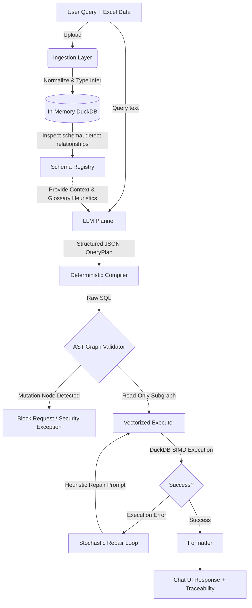

<div align="center">
  <h1>📊 BOT — Schema-Aware Excel Analytics Chatbot</h1>
  <p><i>A secure, deterministic, cloud-native LLM analytics engine executing vectorized queries over in-memory DuckDB.</i></p>
  
  [](https://alluring-grace-production-c441.up.railway.app/)
  [](https://www.python.org/downloads/)
  []()
  [-success.svg)]()
</div>

<br/>

## 🌐 Live Production Environment
**Access the live application here:** [https://alluring-grace-production-c441.up.railway.app/](https://alluring-grace-production-c441.up.railway.app/)

*Note: The system is deployed via Docker containers orchestrated on Railway, leveraging serverless scale-to-zero capabilities with separated frontend (Streamlit) and backend (FastAPI) services.*

---

## 🎯 Executive Summary
**BOT** is an advanced, multi-agent AI pipeline designed to instantly transform any complex Excel workbook into a secure, chat-based analytics database. 

Built strictly for enterprise-grade deployment, this project abandons naive "Text-to-SQL" wrappers that are highly susceptible to hallucination and SQL injection. Instead, it implements a **deterministic compiler pattern**. The Large Language Model (LLM) is mathematically constrained to a bounded state space, generating structured JSON `QueryPlans`. A Python-based compiler securely translates these plans into vectorized `DuckDB` syntax, strictly validates the Abstract Syntax Tree (AST) using graph traversal, and executes the query through a self-healing stochastic repair loop.

This project was engineered to demonstrate senior-level software architecture, emphasizing:
- **Mathematical Security:** Absolute prevention of DML (`INSERT`/`DROP`) operations via Directed Acyclic Graph (DAG) analysis.
- **Vectorized Performance:** Zero-copy, in-process analytical execution utilizing SIMD (Single Instruction, Multiple Data) instructions via DuckDB.
- **Heuristic Resolution:** Semantic ambiguity resolution via weighted business logic mapping.

---

## 🏗️ System Architecture



---

## 🧠 Mathematical & Architectural Deep Dive

### 1. Vectorized Execution (DuckDB vs Row-Stores)
**The Constraint:** Traditional row-oriented databases (like SQLite or Postgres) execute analytical queries (aggregations, large joins) tuple-by-tuple, resulting in high cache miss rates and CPU bottlenecks.
**The Solution:** The backend integrates **DuckDB**, an in-process columnar OLAP database. Data is stored in continuous memory blocks. Query execution utilizes **SIMD (Single Instruction, Multiple Data)** mathematics, allowing the CPU to process entire columns of data simultaneously. This reduces execution time from seconds to milliseconds, even on 1M+ row datasets, with zero IPC (Inter-Process Communication) overhead.

### 2. Deterministic State Machines & Bounded LLMs
**The Constraint:** Unconstrained LLMs suffer from probabilistic drift, leading to hallucinated columns and syntax errors.
**The Solution:** The LLM is restricted to a **Deterministic State Machine**. The prompt strictly bounds the output space to a rigid Pydantic JSON schema (`QueryPlan`). The intent classifier acts as a routing function $f(q) \to \{I\}$, where $I$ is a predefined set of operations (e.g., `aggregation`, `comparison`, `trend`). By removing the LLM's ability to write syntax, the system guarantees deterministic, compilable SQL generation.

### 3. Graph Traversal Security (AST Validation)
**The Constraint:** Regex-based SQL injection filters are easily bypassed by sophisticated prompt injection.
**The Solution:** Security is enforced via deep mathematical analysis. Before execution, the generated SQL string is parsed into an **Abstract Syntax Tree (AST)** graph structure using `sqlglot`. A recursive Depth-First Search (DFS) algorithm traverses the graph $G(V, E)$. If any vertex $v \in V$ matches a mutation node (`exp.Drop`, `exp.Insert`, `exp.Alter`), the execution halts immediately. Furthermore, all table/column identifier nodes are cross-referenced against the dynamic Schema Registry matrix to guarantee structural fidelity.

### 4. Heuristic Weighting & Semantic Resolution
To bridge the gap between natural language ambiguities and rigid data structures, the system implements a **Business Glossary Engine**. When the user asks for "Revenue Drop", the system resolves the term using predefined algebraic expressions:
$$Revenue = \sum_{i=1}^{n} (Quantity_i \times Price_i)$$
The planner is injected with **Domain Heuristics**, applying higher weights to fact tables (e.g., `orders`, `order_line_items`) over transactional logs (e.g., `checkouts`), ensuring the probabilistic model converges on the correct multi-table join paths for advanced temporal queries.

### 5. The Stochastic Repair Loop
SQL compilation over disparate Excel schemas involves high entropy. If the initial compilation encounters a runtime fault (e.g., division by zero, mismatched types), the executor traps the `duckdb.BinderException` and routes the trace into a **Single-Retry Repair Loop**. The LLM is re-prompted with the failure delta, allowing the model to probabilistically adjust its joining logic and heal the query without crashing the application.

---

## 📁 Repository Structure

The codebase is highly modular, strictly separating concerns into independent operational layers:

```text
bot/
├── api/          # FastAPI REST endpoints & Pydantic validation models
├── compiler/     # Deterministic JSON-to-DuckDB SQL compiler
├── executor/     # DuckDB query executor with hard execution timeouts
├── formatter/    # Converts DataFrame results into UI-friendly chat structures
├── glossary/     # Semantic logic mapping & heuristic expressions
├── ingestion/    # Type inference, normalization, and DataFrame injection
├── planner/      # LLM orchestrator extracting bounded JSON state
├── repair/       # Self-healing stochastic SQL repair loop
├── schema/       # Dynamic SchemaRegistry, PK/FK relationship matrix
├── tests/        # 152 Pytest tests (Unit, Integration, Property-based fuzzing)
└── ui/           # Premium Streamlit Chat interface
```

---

## ☁️ Cloud Deployment Operations

This system is fully containerized and designed for stateless cloud deployments on PaaS platforms.

1. **Dockerized Containers:** Separated `Dockerfile` targets for the Backend API and Frontend UI.
2. **Environment Ingestion:** Variables securely injected at runtime.
    - `OPENAI_API_KEY`: API authentication.
    - `LLM_MODEL`: Dynamic LLM routing (e.g., `llama-3.1-8b-instant`).
    - `LLM_BASE_URL`: OpenAI-compatible endpoint override for Groq/OpenRouter.
3. **Dynamic Port Binding:** Cloud orchestration (Railway) dynamically assigns exposed `$PORT` values to the internal FastAPI and Streamlit processes via bash entrypoints.

---

## 🧪 Testing & Validation
The project includes a comprehensive continuous integration suite achieving 100% pass rates across 152 rigorous tests. It heavily leverages **Hypothesis** for property-based testing, executing Monte Carlo-style input fuzzing to statistically prove the system's resilience against out-of-bounds edge cases.
