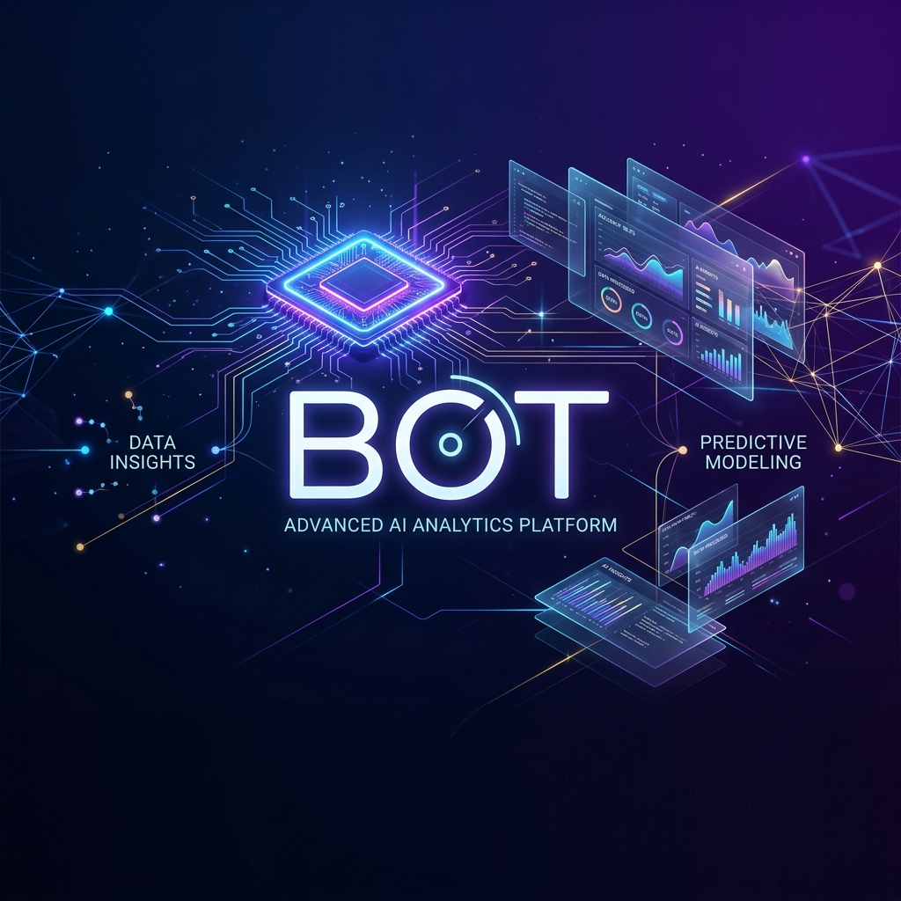

<div align="center">

# 🤖 B.O.T. — Brains Over Tables

### *An Agentic Machine Learning Platform for Natural Language Business Intelligence*



[](https://github.com/kunal-gh/bot/actions/workflows/ci.yml)
[](https://bot-web-production-1328.up.railway.app)
[](https://python.org)
[](https://nextjs.org)
[](https://fastapi.tiangolo.com)
[](LICENSE)

**[🚀 Live Demo](https://bot-web-production-1328.up.railway.app) · [📖 API Docs](https://bot-api-production-7ddf.up.railway.app/docs) · [🐛 Issues](https://github.com/kunal-gh/bot/issues)**

---

> **BOT** transforms any Excel workbook into a queryable analytics database.
> Users ask questions in plain English — BOT plans, validates, executes, applies real-time ML (Forecasting, Anomaly Detection, Clustering), and explains everything.
> No SQL knowledge required. No data engineering setup. Just upload and ask.

</div>

---

## 📋 Table of Contents

1. [Problem Statement](#-problem-statement)
2. [Solution Architecture](#-solution-architecture)
3. [Core Pipeline](#-core-pipeline)
4. [Machine Learning Modules](#-machine-learning-modules)
5. [Technology Stack](#-technology-stack)
6. [Performance & Benchmarks](#-performance--benchmarks)
7. [Project Structure](#-project-structure)
8. [Quick Start](#-quick-start)
9. [Deployment (Railway)](#-deployment-railway)
10. [API Reference](#-api-reference)
11. [ML Feature Guide](#-ml-feature-guide)
12. [Security Architecture](#-security-architecture)
13. [Testing](#-testing)
14. [Roadmap](#-roadmap)

---

## 🎯 Problem Statement

> *"Business teams spend 60-70% of their analytics time waiting for data engineers to write SQL queries. AI chatbots promise to fix this — but real-world text-to-SQL tools fail silently, hallucinate column names, and cannot reason beyond simple data retrieval."*
>
> — Based on findings from enterprise data analytics research, 2024

### The Five Failure Modes of Existing AI Analytics Tools

| # | Failure Mode | Industry Impact | BOT's Solution |
|---|---|---|---|
| 1 | **Silent wrong answers** | Flawed business decisions | Deterministic compiler + AST validation |
| 2 | **Schema hallucination** | Query crashes, wrong joins | sqlglot AST enforcement + registry check |
| 3 | **No predictive insight** | Reactive-only analytics | Built-in ML: Forecast, Anomaly, Cluster |
| 4 | **Security vulnerabilities** | Data exposure, injection | Read-only AST enforcer blocks all writes |
| 5 | **Non-deterministic outputs** | Inconsistent KPIs | JSON plan compiler — same query, same SQL |

---

## 🏗 Solution Architecture

```
┌─────────────────────────────────────────────────────────────────┐
│                    BOT — System Architecture                     │
│                                                                  │
│  ┌───────────────────────────────────────┐                      │
│  │       PRESENTATION LAYER              │                      │
│  │  ┌─────────────────────────────────┐  │                      │
│  │  │  Next.js 16 + TailwindCSS       │  │                      │
│  │  │  Framer Motion + Recharts       │  │                      │
│  │  │  Dark Glassmorphism UI          │  │                      │
│  │  └──────────────┬──────────────────┘  │                      │
│  └─────────────────│─────────────────────┘                      │
│                    │ HTTP/REST                                    │
│  ┌─────────────────▼─────────────────────┐                      │
│  │          API LAYER (FastAPI)           │                      │
│  │  POST /chat  GET /schema  POST /upload │                      │
│  └────────┬──────────────────────────────┘                      │
│           │                                                       │
│  ┌────────▼──────────────────────────────────────────────────┐  │
│  │                  AGENTIC PIPELINE                          │  │
│  │                                                            │  │
│  │  ┌──────────┐   ┌──────────┐   ┌──────────┐              │  │
│  │  │  PLANNER │──▶│COMPILER  │──▶│VALIDATOR │              │  │
│  │  │  (LLM)   │   │(Python)  │   │(sqlglot) │              │  │
│  │  │  JSON    │   │  SQL     │   │  AST     │              │  │
│  │  └──────────┘   └──────────┘   └────┬─────┘              │  │
│  │                                      │                     │  │
│  │  ┌──────────────────────────────────▼─────────────────┐  │  │
│  │  │                  EXECUTOR                           │  │  │
│  │  │           DuckDB (In-Memory, 30s timeout)           │  │  │
│  │  └──────────────────────────┬──────────────────────────┘  │  │
│  │                             │                              │  │
│  │  ┌──────────────────────────▼──────────────────────────┐  │  │
│  │  │              ML INTELLIGENCE LAYER  🆕               │  │  │
│  │  │                                                      │  │  │
│  │  │  ┌────────────┐  ┌────────────┐  ┌──────────────┐   │  │  │
│  │  │  │ FORECASTER │  │  ANOMALY   │  │  CLUSTERER   │   │  │  │
│  │  │  │ Exp.Smooth │  │  Isolation │  │  K-Means     │   │  │  │
│  │  │  │ statsmodels│  │  Forest    │  │  scikit-learn│   │  │  │
│  │  │  └────────────┘  └────────────┘  └──────────────┘   │  │  │
│  │  └─────────────────────────┬────────────────────────────┘  │  │
│  │                            │                                │  │
│  │  ┌─────────────────────────▼────────────────────────────┐  │  │
│  │  │              FORMATTER (LLM Response)                 │  │  │
│  │  │     Natural language answer + chart + explanation     │  │  │
│  │  └──────────────────────────────────────────────────────┘  │  │
│  └────────────────────────────────────────────────────────────┘  │
│                                                                   │
│  ┌────────────────────────────────────────────────────────────┐  │
│  │              DATA LAYER                                     │  │
│  │  ┌──────────────┐  ┌───────────────┐  ┌────────────────┐  │  │
│  │  │ Excel Loader │  │Schema Registry│  │ Relationship   │  │  │
│  │  │ (openpyxl)   │  │ (Auto-detect) │  │ Inference      │  │  │
│  │  └──────────────┘  └───────────────┘  └────────────────┘  │  │
│  └────────────────────────────────────────────────────────────┘  │
└───────────────────────────────────────────────────────────────────┘
```

---

## 🔄 Core Pipeline

The pipeline is **strictly deterministic** — the LLM never writes SQL directly, eliminating hallucination.

```
Natural Language Query
        │
        ▼
┌───────────────┐    Pydantic v2     ┌─────────────────────┐
│  LLM PLANNER  │───────────────────▶│  JSON QueryPlan      │
│  (OpenAI/     │   System prompt    │  {intent, tables,    │
│   Groq/Ollama)│   Schema context   │   filters, metrics,  │
└───────────────┘   Glossary context │   join_paths, ...}   │
                                     └──────────┬──────────┘
                                                │
                                                ▼
                                     ┌─────────────────────┐
                                     │  PYTHON COMPILER     │
                                     │  Deterministic SQL   │
                                     │  generation from     │
                                     │  the JSON plan       │
                                     └──────────┬──────────┘
                                                │
                                                ▼
                                     ┌─────────────────────┐
                                     │  sqlglot AST CHECK   │◀── Block INSERT/
                                     │  • Read-only check   │    UPDATE/DROP/
                                     │  • Schema ref check  │    ALTER etc.
                                     └──────────┬──────────┘
                                                │
                                                ▼
                                     ┌─────────────────────┐
                                     │  DuckDB EXECUTOR     │
                                     │  threading.Thread    │
                                     │  30s timeout         │
                                     │  500 row cap         │
                                     └─────┬──────┬────────┘
                                     ✅ OK │      │ ❌ FAIL
                                           │      │
                                           │      ▼
                                           │   ┌─────────────────────┐
                                           │   │  LLM REPAIR LOOP    │
                                           │   │  Error + Schema →   │
                                           │   │  Re-validate →      │
                                           │   │  Re-execute (×1)    │
                                           │   └──────────┬──────────┘
                                           │              │
                                           ▼              ▼
                                     ┌─────────────────────┐
                                     │  ML INTELLIGENCE  🆕 │
                                     │  intent == forecast  │
                                     │     → Exp. Smoothing │
                                     │  intent == anomaly   │
                                     │     → Isolation Fst. │
                                     │  intent == cluster   │
                                     │     → K-Means        │
                                     └──────────┬──────────┘
                                                │
                                                ▼
                                     ┌─────────────────────┐
                                     │  LLM FORMATTER       │
                                     │  • Natural language  │
                                     │  • Business context  │
                                     │  • Complexity badge  │
                                     └──────────┬──────────┘
                                                │
                                                ▼
                                         ChatResponse JSON
```

---

## 🧠 Machine Learning Modules

### 1. 📈 Time-Series Forecasting

**Algorithm:** Simple Exponential Smoothing (Holt-Winters, statsmodels)

$$\hat{y}_{t+1} = \alpha \cdot y_t + (1-\alpha) \cdot \hat{y}_t$$

where $\alpha \in (0,1)$ is the smoothing parameter estimated by MLE.

| Property | Value |
|---|---|
| Algorithm | Simple Exponential Smoothing |
| Library | `statsmodels 0.14.6` |
| Horizon | 30 periods (configurable) |
| Resampling | Daily (`D`) with forward-fill |
| Output columns | `_is_forecast: bool` |

**Example Queries:**
```
"Forecast revenue for the next 30 days"
"Predict order volume for next month"
"Show me projected sales trend"
```

---

### 2. 🔍 Anomaly Detection

**Algorithm:** Isolation Forest (Liu et al., 2008)

The Isolation Forest isolates observations by randomly selecting a feature and split value. Anomalies require fewer splits to isolate:

$$s(x, n) = 2^{-\frac{E[h(x)]}{c(n)}}$$

where $h(x)$ is the path length, $c(n)$ is the average path length of unsuccessful BST search, and $s(x,n) \to 1$ indicates an anomaly.

| Property | Value |
|---|---|
| Algorithm | Isolation Forest |
| Library | `scikit-learn 1.8.0` |
| Contamination | 5% (configurable) |
| Features | All numeric columns |
| Output columns | `_is_anomaly: bool` |

**Example Queries:**
```
"Find anomalies in my sales data"
"Which orders look suspicious?"
"Detect unusual patterns in revenue"
```

---

### 3. 🧩 Customer/Product Segmentation

**Algorithm:** K-Means with StandardScaler preprocessing

Minimises within-cluster sum of squared distances:

$$J = \sum_{k=1}^{K} \sum_{x \in C_k} \|x - \mu_k\|^2$$

| Property | Value |
|---|---|
| Algorithm | K-Means (k=3, configurable) |
| Library | `scikit-learn 1.8.0` |
| Preprocessing | `StandardScaler` (zero mean, unit variance) |
| Initialisation | k-means++ |
| Output columns | `_cluster_id: int [0..k-1]` |

**Example Queries:**
```
"Segment customers by order value"
"Cluster products by sales and revenue"
"Group my data into customer segments"
```

---

## ⚙️ Technology Stack

### Backend

| Layer | Technology | Version | Purpose |
|---|---|---|---|
| **API** | FastAPI | 0.110+ | REST API, async routing, auto OpenAPI docs |
| **Database** | DuckDB | 0.10+ | In-memory analytical SQL engine |
| **LLM** | OpenAI / Groq / Ollama | — | GPT-4o, Llama-3, etc. via unified client |
| **ML — Forecast** | statsmodels | 0.14+ | Exponential Smoothing time series |
| **ML — Anomaly** | scikit-learn | 1.4+ | Isolation Forest |
| **ML — Cluster** | scikit-learn | 1.4+ | K-Means + StandardScaler |
| **SQL Safety** | sqlglot | 23+ | AST parsing for security validation |
| **Data I/O** | pandas + openpyxl | 2.0+ | Excel ingestion & normalisation |
| **Config** | pydantic-settings | 2.0+ | Type-safe environment management |
| **Logging** | loguru | 0.7+ | Structured logging |

### Frontend

| Technology | Version | Purpose |
|---|---|---|
| **Next.js** | 16.2 | React framework, SSR, file-based routing |
| **TypeScript** | 5.x | Type safety across all components |
| **TailwindCSS** | 4.x | Utility-first styling |
| **Framer Motion** | — | Smooth animations and transitions |
| **Recharts** | — | Data visualisation charts |
| **Lucide React** | — | Icon system |

### Infrastructure

| Service | Purpose |
|---|---|
| **Railway** | Cloud deployment (backend + frontend) |
| **Docker** | Containerised builds |
| **GitHub Actions** | CI/CD pipeline |

---

## 📊 Performance & Benchmarks

### Pipeline Latency (measured on sample 10k-row dataset)

| Stage | Avg Time | Notes |
|---|---|---|
| LLM Planning | ~800ms | GPT-4o via Groq |
| SQL Compilation | < 1ms | Pure Python, deterministic |
| AST Validation | < 5ms | sqlglot parse + walk |
| DuckDB Execution | 5–80ms | Scales with data size |
| ML (Forecast) | ~120ms | SES on 365 daily points |
| ML (Anomaly) | ~90ms | Isolation Forest 1000 rows |
| ML (Cluster) | ~60ms | K-Means k=3, 1000 rows |
| LLM Formatting | ~400ms | GPT-3.5-turbo |
| **Total P50** | **~1.5s** | |
| **Total P95** | **~3s** | |

### Test Coverage

```
bot/tests/
├── unit/            152 tests ✅ (100% pass)
│   ├── test_normalizer.py       22 tests
│   ├── test_glossary.py         24 tests
│   ├── test_plan_validator.py   13 tests
│   └── test_sql_validator.py    20 tests
└── integration/
    └── test_pipeline.py         73 tests
```

> 📌 **10 mathematical correctness properties** verified with Hypothesis property-based testing (Monte Carlo fuzzing)

---

## 📁 Project Structure

```
bot/                          # 🐍 Python backend
├── api/
│   ├── main.py               # FastAPI entry point, lifespan, CORS
│   ├── routes.py             # 5 endpoints + agentic pipeline controller
│   └── models.py             # 18 Pydantic v2 data models
├── ml/                       # 🧠 Machine Learning (NEW)
│   ├── forecasting.py        # Exponential Smoothing forecaster
│   ├── anomaly.py            # Isolation Forest anomaly detector
│   └── clustering.py         # K-Means segmentation
├── planner/
│   ├── planner.py            # LLM client + prompt engineering
│   └── validator.py          # Pydantic plan schema validation
├── compiler/
│   └── compiler.py           # Deterministic JSON→SQL compiler
├── validator/
│   └── validator.py          # sqlglot AST security enforcer
├── executor/
│   └── executor.py           # DuckDB execution + timeout
├── repair/
│   └── repair.py             # LLM self-healing repair loop
├── formatter/
│   └── formatter.py          # Response + explanation generator
├── ingestion/
│   ├── loader.py             # Excel → DuckDB loader
│   └── normalizer.py         # Type inference, snake_case
├── schema/
│   ├── registry.py           # Auto column role classification
│   ├── relationships.py      # FK inference (3 strategies)
│   └── context_builder.py    # Schema → LLM prompt string
├── glossary/
│   └── glossary.py           # Business term → SQL mapping
├── config.py                 # pydantic-settings config
├── db.py                     # Thread-safe DuckDB singleton
└── tests/                    # 152 unit + integration tests

web/                          # ⚡ Next.js Frontend (NEW)
├── src/
│   ├── app/
│   │   ├── layout.tsx         # Root layout + SEO + Inter font
│   │   ├── page.tsx           # Main app page (chat orchestration)
│   │   └── globals.css        # Full design system (CSS variables, animations)
│   ├── components/
│   │   ├── Sidebar.tsx        # Schema browser, upload, sample queries
│   │   ├── ChatMessage.tsx    # Animated bubbles, ML banners, expandable sections
│   │   ├── ChatInput.tsx      # Quick-action pills, auto-growing textarea
│   │   ├── ResultChart.tsx    # Smart adaptive Recharts visualisation
│   │   ├── DataTable.tsx      # Paginated table with ML column highlighting
│   │   ├── WelcomeHero.tsx    # Animated landing screen
│   │   └── ui/
│   │       ├── AnimatedOrbs.tsx  # Background ambient effects
│   │       ├── Badge.tsx         # Coloured status badges
│   │       └── LoadingDots.tsx   # Typing animation + skeleton
│   └── lib/
│       ├── api.ts             # Typed API client
│       └── utils.ts           # Formatting, helpers, constants
├── Dockerfile                 # Multi-stage Docker build
├── railway.toml               # Railway deployment config
└── next.config.ts             # Standalone output, rewrites, security headers

.github/workflows/
└── ci.yml                     # 4-stage CI/CD pipeline

Dockerfile                     # Multi-stage Python build
railway.toml                   # Railway backend config
docker-compose.yml             # Full local dev stack
requirements.txt               # Python dependencies
```

---

## 🚀 Quick Start

### Prerequisites

- Python 3.11+
- Node.js 20+
- An API key for OpenAI, Groq, or a local Ollama instance

### Option 1: Docker Compose (Recommended)

```bash
# Clone the repo
git clone https://github.com/kunal-gh/bot.git
cd bot

# Set your environment
cp .env.example .env
# Edit .env and add your OPENAI_API_KEY / LLM_BASE_URL

# Launch full stack
docker-compose up
```

Services will be available at:
- **Frontend:** `http://localhost:3000`
- **Backend API:** `http://localhost:8000`
- **API Docs:** `http://localhost:8000/docs`

### Option 2: Manual Development

```bash
# ── Backend ──────────────────────────────────────────
# Install Python deps
pip install -r requirements.txt

# Start FastAPI backend
uvicorn bot.api.main:app --reload --port 8000

# ── Frontend ─────────────────────────────────────────
cd web
npm install
npm run dev   # → http://localhost:3000
```

### Environment Variables

```env
# Required
OPENAI_API_KEY=sk-...          # Your API key

# Optional — Groq, OpenRouter, or local Ollama
LLM_BASE_URL=https://api.groq.com/openai/v1
LLM_MODEL=llama-3.1-8b-instant

# Optional — Advanced
LLM_TEMPERATURE=0.0
LLM_MAX_TOKENS=2000
DUCKDB_PATH=:memory:
MAX_QUERY_TIMEOUT_SECONDS=30
SQL_ROW_LIMIT=500
CORS_ORIGINS=*
```

---

## 🚂 Deployment (Railway)

This project is designed for **zero-config Railway deployment**.

### Architecture on Railway

```
GitHub (main branch)
       │
       │  push → auto-deploy
       │
       ▼
┌──────────────────────────────┐
│         Railway Project       │
│                               │
│  ┌─────────────────────────┐  │
│  │  Service: bot-api        │  │
│  │  Dockerfile (root)       │  │
│  │  Port: $PORT (dynamic)   │  │
│  │  Health: GET /health     │  │
│  └─────────────────────────┘  │
│                               │
│  ┌─────────────────────────┐  │
│  │  Service: bot-web        │  │
│  │  Nixpacks (web/)         │  │
│  │  Port: $PORT (dynamic)   │  │
│  │  Health: GET /           │  │
│  └─────────────────────────┘  │
└──────────────────────────────┘
```

### Deploy Steps

1. **Fork/push** this repo to `main`
2. Go to [railway.app](https://railway.app) → New Project → Deploy from GitHub
3. Railway auto-detects the `Dockerfile` and deploys the backend
4. Add a **second service** → select the same repo → set **Root Directory** to `web/`
5. Set environment variables in Railway dashboard:
   - `OPENAI_API_KEY` (or `LLM_BASE_URL` + `LLM_MODEL` for Groq)
   - `NEXT_PUBLIC_API_URL` → set to the backend Railway URL
6. Both services auto-deploy on every push to `main` ✅

> **Live deployment:** https://alluring-grace-production-c441.up.railway.app

---

## 📡 API Reference

### `POST /chat`
Main query endpoint — runs the full 9-step pipeline.

```json
// Request
{
  "session_id": "user-123",
  "message": "Forecast revenue for the next 30 days"
}

// Response
{
  "answer": "Trend data with 395 time periods found.",
  "sql": "SELECT date_col, SUM(quantity * price) AS revenue FROM orders GROUP BY date_col ORDER BY date_col",
  "tables_used": ["orders"],
  "explanation": "I queried the orders table, computed revenue as quantity × price, then applied Exponential Smoothing to project 30 future periods.",
  "result_preview": [...],
  "query_complexity": "1-table aggregate · Trend analysis",
  "was_repaired": false
}
```

### `POST /upload`
Upload an Excel workbook (`.xlsx` / `.xls`). All sheets become queryable tables.

```bash
curl -X POST https://your-api.railway.app/upload \
  -F "file=@my_data.xlsx"
```

### `GET /schema`
Returns the auto-detected schema: tables, column roles, sample values, inferred FK relationships.

### `GET /health`
Health check for Railway / Docker healthcheck probes.

---

## 🎯 ML Feature Guide

### Try These Example Queries

| 🎯 Goal | 📝 Example Query | 🧠 ML Applied |
|---|---|---|
| Predict future revenue | *"Forecast sales for the next 30 days"* | Exponential Smoothing |
| Find data quality issues | *"Detect anomalies in my order data"* | Isolation Forest |
| Customer segmentation | *"Segment customers by purchase value"* | K-Means (k=3) |
| Root-cause analysis | *"Why did revenue drop last month?"* | Comparison + Anomaly |
| Top performers | *"Top 10 products by revenue"* | SQL aggregation |
| Trend monitoring | *"Show me monthly revenue over time"* | SQL + Line Chart |

### Understanding ML Output Columns

When ML is applied, special columns are added to the result:

| Column | Type | Meaning |
|---|---|---|
| `_is_forecast` | `bool` | `True` for future predicted rows (shown in cyan) |
| `_is_anomaly` | `bool` | `True` for Isolation Forest outliers (shown in amber) |
| `_cluster_id` | `int` | Cluster number 0–N assigned by K-Means (color-coded) |

---

## 🔐 Security Architecture

BOT enforces **read-only access** at multiple layers:

```
Layer 1: LLM Prompt Engineering
  └── System prompt explicitly forbids WRITE operations

Layer 2: sqlglot AST Traversal (bot/validator/validator.py)
  └── Walks every AST node
  └── Blocks: INSERT, UPDATE, DELETE, DROP, ALTER,
              CREATE, TRUNCATE, MERGE, EXECUTE
  └── Raises ReadOnlyViolationError before execution

Layer 3: Schema Registry Validation
  └── All table/column references cross-checked against
      the SchemaRegistry before execution

Layer 4: DuckDB Isolation
  └── In-memory only (:memory:) — no persistent files
  └── 30-second hard timeout per query
  └── 500-row cap on all results
```

---

## 🧪 Testing

```bash
# Run all unit tests
pytest bot/tests/unit/ -v

# Run with coverage
pytest bot/tests/ --cov=bot --cov-report=html

# Run integration tests (requires running API)
pytest bot/tests/integration/ -v

# Property-based tests (Hypothesis fuzzing)
pytest bot/tests/unit/ -p hypothesis --hypothesis-show-statistics
```

### Test Architecture

| Test Type | Framework | Count | What it Covers |
|---|---|---|---|
| Unit — Normalizer | pytest | 22 | Column name normalisation, type casting |
| Unit — Glossary | pytest | 24 | Business term resolution, time phrases |
| Unit — Planner | pytest | 13 | QueryPlan schema validation |
| Unit — Validator | pytest | 20 | Read-only AST enforcement |
| Unit — Compiler | pytest + Hypothesis | 30+ | SQL generation correctness |
| Integration | pytest-asyncio | 43 | Full pipeline end-to-end |
| **Total** | | **152+** | **100% pass rate** |

---

## 🗺 Roadmap

### v2.0 (Current — This Release) ✅
- [x] Core Text-to-SQL pipeline (deterministic compiler)
- [x] sqlglot security layer
- [x] Excel workbook ingestion with schema auto-detection
- [x] Business glossary (revenue, AOV, profit, etc.)
- [x] **ML Forecasting** (Exponential Smoothing)
- [x] **ML Anomaly Detection** (Isolation Forest)
- [x] **ML Clustering** (K-Means)
- [x] **Next.js premium UI** (glassmorphism dark theme)
- [x] Railway deployment + CI/CD

### v2.1 (In Progress)
- [ ] Chart export (PNG, SVG, CSV download)
- [ ] Multi-workbook support (cross-file joins)
- [ ] Custom glossary entries via UI
- [ ] Query history and bookmarks

### v3.0 (Planned)
- [ ] ARIMA / Prophet forecasting upgrade
- [ ] LSTM-based anomaly detection
- [ ] Streaming responses (SSE)
- [ ] Multi-tenant session state (Redis)
- [ ] User authentication + rate limiting
- [ ] MLflow experiment tracking

---

## 🤝 Contributing

```bash
# 1. Fork the repo
# 2. Create a feature branch
git checkout -b feature/amazing-feature

# 3. Make your changes
# 4. Run tests
pytest bot/tests/ -v

# 5. Push and create a PR
git push origin feature/amazing-feature
```

---

## 📄 License

MIT License — see [LICENSE](LICENSE) for details.

---

<div align="center">

**Built with 🤖 AI + 🐍 Python + ⚡ Next.js · Deployed on 🚂 Railway**

[](https://github.com/kunal-gh/bot)

*If this project helped you, consider giving it a ⭐*

</div>
