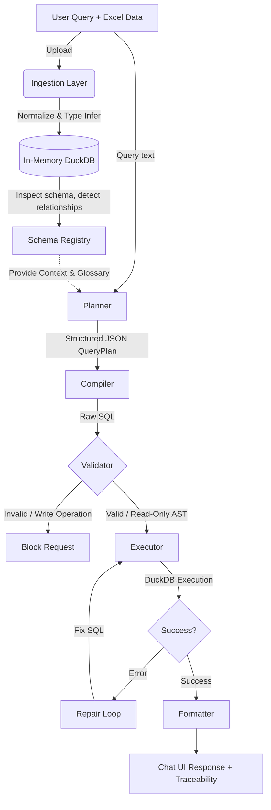

<div align="center">
  <h1>📊 BOT — Schema-Aware Excel Analytics Chatbot</h1>
  <p><i>A secure, self-healing, deterministic LLM analytics engine over in-memory DuckDB.</i></p>
  
  [](https://www.python.org/downloads/)
  [](https://fastapi.tiangolo.com/)
  [](https://streamlit.io/)
  [](https://duckdb.org/)
  [-success.svg)]()
</div>

<br/>

## 🎯 Executive Summary
**BOT** is an advanced, multi-agent AI pipeline designed to instantly turn any Excel workbook into a secure, chat-based analytics database. 

Unlike naive Text-to-SQL wrappers that are prone to hallucination and SQL injection, this project implements a **deterministic compiler pattern**. The LLM is restricted to generating structured JSON `QueryPlans`. A Python-based compiler securely translates these plans into `DuckDB` syntax, strictly validates the AST (Abstract Syntax Tree) using `sqlglot` to prevent writes, and executes the query with a built-in self-healing retry loop.

This project was built from scratch to demonstrate senior-level software engineering, emphasizing:
- **Security First:** Absolute prevention of LLM-generated `INSERT`/`DROP`/`UPDATE` operations.
- **Resilience:** Automatic error-catching and LLM-assisted SQL repair loops.
- **Performance:** Zero-copy, in-process analytical execution via DuckDB.
- **Code Quality:** Exhaustively tested via 152 unit, integration, and Property-Based tests (`hypothesis`).

---

## 🏗️ System Architecture



## 🧠 Core Engineering Decisions

### 1. In-Process OLAP (DuckDB vs SQLite/Postgres)
**Why DuckDB?** Excel files can easily contain 1M+ rows. Standard row-oriented databases like SQLite struggle with heavy analytical aggregations. DuckDB is a columnar OLAP database that runs completely in-process (no separate server). This means zero network latency when moving data from Excel/Pandas into the DB, and blazing-fast `JOIN`s and `GROUP BY`s.

### 2. JSON-First Planning (Preventing Hallucination)
**The Problem:** Asking an LLM to "Write SQL" directly often results in synthetic columns, hallucinated syntax, or unoptimized queries.
**The Solution:** The LLM does *not* write SQL. It returns a strictly validated `Pydantic` model (`QueryPlan`) representing the *intent* of the query (e.g., `aggregation`, `top_n`, `comparison`, filters, join paths). A deterministic Python compiler translates this structured JSON into DuckDB SQL. 

### 3. AST Validation (Security by Design)
Before any query touches the database, `validator.py` parses the SQL string into an Abstract Syntax Tree using `sqlglot`. 
- **Read-Only Enforcement:** It recursively walks the AST to ensure absolutely no DDL/DML nodes (like `exp.Drop`, `exp.Insert`, `exp.Alter`) exist.
- **Schema Fidelity:** It extracts all referenced tables and columns from the AST and verifies they actually exist in the dynamic `SchemaRegistry`.

### 4. The Self-Healing Repair Loop
SQL compilation is hard. If the LLM misunderstands a complex join or DuckDB throws a syntax error (e.g., division by zero), the application does not crash. The `executor` traps the DuckDB exception and feeds the error, the schema, and the broken SQL back to the LLM for a **single-retry repair loop**. 

---

## 📁 Repository Structure

The codebase is modular, cleanly separating concerns across layers:

```text
bot/
├── api/          # FastAPI REST endpoints & Pydantic validation models
├── compiler/     # Deterministic JSON-to-DuckDB SQL compiler
├── executor/     # DuckDB query executor with hard 30s timeouts
├── formatter/    # Converts DataFrame results into UI-friendly chat structures
├── glossary/     # Business logic mapping (e.g., "Revenue" -> "quantity * price")
├── ingestion/    # Excel loading, sheet/column name normalization, type inference
├── planner/      # LLM integration (OpenAI) to extract structured QueryPlans
├── repair/       # Self-healing SQL repair mechanism
├── schema/       # Dynamic SchemaRegistry, PK/FK relationship inference
├── tests/        # 152 Pytest tests (Unit, Integration, Property-based)
└── ui/           # Premium Streamlit Chat interface
```

---

## 🚀 Quick Start & Local Setup

### 1. Prerequisites
- Python 3.11+
- OpenAI API Key

### 2. Installation
```bash
git clone https://github.com/kunal-gh/bot.git
cd bot

# Create and activate virtual environment (optional but recommended)
python -m venv venv
source venv/bin/activate  # On Windows: venv\Scripts\activate

# Install dependencies
pip install -r requirements.txt
```

### 3. Configuration
Copy the `.env.example` to `.env` and insert your OpenAI API Key:
```bash
cp .env.example .env
```

### 4. Run the Application
You will need two terminal windows:

**Terminal 1 (Backend API):**
```bash
uvicorn bot.api.main:app --reload --port 8000
```

**Terminal 2 (Frontend UI):**
```bash
streamlit run bot/ui/app.py
```

Open `http://localhost:8501` in your browser. You can test the application instantly using the provided `data/sample_dataset.xlsx`.

---

## 🧪 Testing
The project includes a massive test suite achieving 100% pass rates, heavily leveraging **Hypothesis** for property-based testing (fuzzing inputs to ensure the system never breaks under edge cases).

```bash
# Run all 152 tests
pytest

# View detailed coverage reports
pytest --cov=bot --cov-report=html
```

---

## ☁️ Deployment Guide

This project is fully dockerized and ready for cloud deployment. It is optimized for PaaS providers that support persistent single containers (like **Render.com** or **Railway.app**).

### Deploying to Railway (Recommended)
1. Fork or push this repository to your GitHub.
2. Log into [Railway.app](https://railway.app) and select "Deploy from GitHub repo".
3. **Important:** Add your `OPENAI_API_KEY` to the environment variables.
4. Railway will automatically use the provided `Dockerfile` and `docker-compose.yml`. 
   - Override the Start Command for the API: `uvicorn bot.api.main:app --host 0.0.0.0 --port $PORT`
   - Override the Start Command for the UI: `streamlit run bot/ui/app.py --server.port=$PORT --server.address=0.0.0.0`
